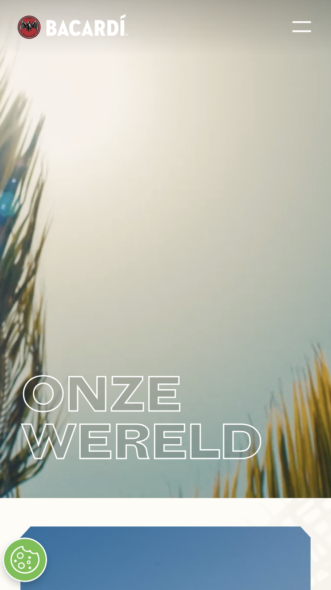
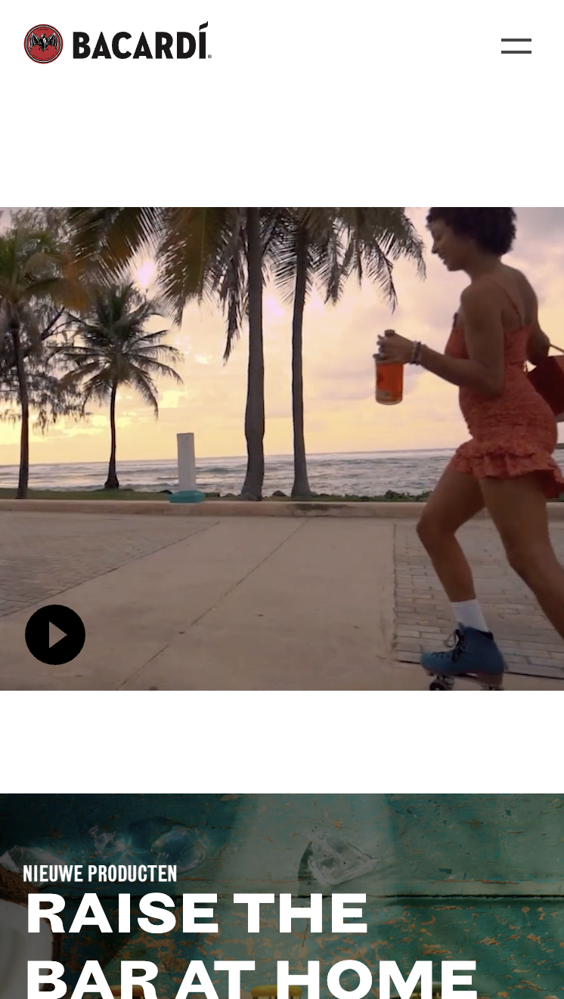
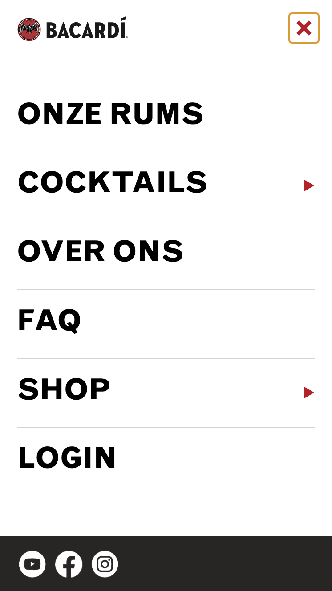
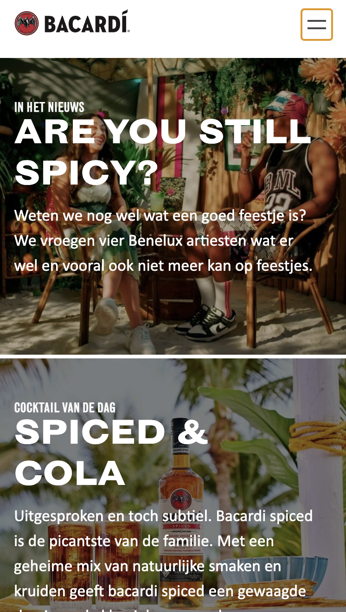

# Procesverslag

Markdown is een simpele manier om HTML te schrijven.  
Markdown cheat cheet: [Hulp bij het schrijven van Markdown](https://github.com/adam-p/markdown-here/wiki/Markdown-Cheatsheet).

Nb. De standaardstructuur en de spartaanse opmaak van de README.md zijn helemaal prima. Het gaat om de inhoud van je procesverslag. Besteedt de tijd voor pracht en praal aan je website.

Nb. Door _open_ toe te voegen aan een _details_ element kun je deze standaard open zetten. Fijn om dat steeds voor de relevante stuk(ken) te doen.

## Jij

  
uitwerken voor kick-off werkgroep

### Auteur:

Vivanne Hoogendam

#### Je startniveau:

blauw

#### Je focus:

Surface plane

## Je website

  
uitwerken voor kick-off werkgroep

### Je opdracht:

https://www.bacardi.com/nl/nl/

#### Screenshot(s) van de eerste pagina (small screen):

BACARDI HOMEPAGE

#### Screenshot(s) van de tweede pagina (small screen):

OVER ONS PAGINA

## Toegankelijkheidstest 1/2 (week 1)

  
uitwerken na test in 2e werkgroep

### Bevindingen

Na de test gedaan te hebben ben ik erachter gekomen dat De Bacardi site wel heel mooi is gemaakt alleen dat er teveel div's en classes gebruikt zijn, er geen h1 op de eerste pagina staat en er geen rekening is gehouden met mensen die een beperking hebben.
Wat ik moet gaan toevoegen aan de huidige site:

- Skip to main content button
- Pauzeer knop voor de videos'
- H1
- Dark Mode

## Breakdownschets (week 1)

  
uitwerken na afloop 3e werkgroep

### de hele pagina:

### dynamisch deel (bijv menu):

### wellicht nog een dynamisch deel (bijv filter):

  

## Voortgang 1 (week 2)

  
uitwerken voor 1e voortgang

### Stand van zaken

- Ik heb doormiddel van oefeningen in de les mijn eerste section kunnen uitwerken met position relative en absolute. Zie screenshot hierboven.

-dropdown menu is me ook gelukt na de meeting. Alleen de vormgeving mist nog.

### Agenda voor meeting

samen met je groepje opstellen

| student 1                                                                                                                       | student 2          | student 3    | student 4        |
| ------------------------------------------------------------------------------------------------------------------------------- | ------------------ | ------------ | ---------------- |
| We waren met ons groepje helaas niet goed voorbereid. Dus geen echte vaste vragen bedacht. Maar de bevindingen staan hieronder. | en dit             | en ik dit    | en dan ik dat    |
| en dat ook nog                                                                                                                  | dit als er tijd is | nog een punt | dit wil ik zeker |
| ...                                                                                                                             | ...                | ...          | ...              |

### Verslag van meeting

hier na afloop snel de uitkomsten van de meeting vastleggen

- Dropdown menu uitwerking.
- A11y Hide content kunnen toepassen voor de h1.
- Meta data in de head tag aanpassen.
- Kleuren voor de achtergrond gebruiken is goed genoeg.
- Border bottom/top gebruiken voor lijntjes onder tekst.

## Voortgang 2 (week 3)

  
uitwerken voor 2e voortgang

### Stand van zaken

--> het uitwerken van een footer ging uiteindelijk veel makkelijker dan gedacht. Ik moet het niet ingewikkelder maken dan het is.

--> Ik ben de hamburger menu aan het uitstellen omdat ik niet weet waar ik moet beginnen.

--> Ik kan ondertussen wel inschatten wanneer ik wel en niet divs mag plaatsen.

--> Ik moet nogsteeds beginnen aan het surface plane gedeelte maken van mijn website.

--> Tot nu toe gelukt en klaar: Footer, Nav bar (alleen niet klikbaar), de fonts zijn erin gezet, de eerste sectie is af (na het plaatsen van een gradient.)

wat wil ik graag weten?

-- Kan je makkelijk een gradient overlay boven een image plaatsen?

### Agenda voor meeting

samen met je groepje opstellen

| student 1                                                                                  | student 2                 | student 3                                                                                                     | student 4                                                                                |
| ------------------------------------------------------------------------------------------ | ------------------------- | ------------------------------------------------------------------------------------------------------------- | ---------------------------------------------------------------------------------------- |
| vraag 1: Ik wil graag bespreken hoe je een carasoul moet maken en knoppen bij de carousel? |                           | Kan je met css een gradient overlay geven aan een img? Of is het handiger om dat gewoon met photoshop te doen | Hoe kan ik ervoor zorgen dat de scroller eindeloos door loopt.                           |
| Video op 100% groot scherm krijgen                                                         | Wat vragen over animeren. | nog een punt                                                                                                  | Oplossing van probleem met het wijzigen van de volgorde waarin items worden weergegeven. |
| ...                                                                                        | ...                       | ...                                                                                                           | ...                                                                                      |

### Verslag van meeting

hier na afloop snel de uitkomsten van de meeting vastleggen

- Mijn html code was netjes opgebouwd
- Ik kon bij de eerste section de divs en sections omwisselen. Alleen toen ik dit ging proberen ging mijn hele code door de war en wist ik het niet te fixen. Ik heb dus om de error van de section weg te krijgen een h2 met een display none toegevoegd. (dit ga ik waarschijnlijk vaker doen.)
- ipv een gradient overlay kon ik de brightness aanpassen door op de img: filter: brightness() te gebruiken.

## Toegankelijkheidstest 2/2 (week 4)

  
uitwerken na test in 9e werkgroep

### Bevindingen

- ik kan de video pauzeren, alleen nog niet doormiddel van een knop, maar om op de video zelf te klikken. Hij speelt daarna ook niet nog een keer af als je er nog een keer op klikt.
- De h1 staat erin geplaatst en wordt genoemd als de screenreader aanstaat.
- Code is semantisch correct
- ik moet alleen de figcaption en de img in de figure even van positie veranderen zodat de figcaption eerst genoemd wordt.
- ik moest de skip to main content button nog maken.

## Voortgang 3 (week 4)

  
uitwerken voor 3e voortgang

### Stand van zaken

- Mijn hamburger menu is kan nu open en dicht. Hij moet alleen nog wel op de juiste manier gestijld worden. Hier heb ik alleen helaas geen foto van gemaakt.
- Ik heb darkmode kunnen instellen in mijn css bestand en heb dus alle kleuren in de root gezet.
  
  
- ik ben begonnen met het organiseren van mijn code. Hier was ik eerder nog niet echt mee bezig, en heb nu een aantal div's kunnen vervangen met sections wat me eerder deze weken erg veel chaos bracht.

### Agenda voor meeting

samen met je groepje opstellen

| student 1                                                                                  | student 2                                                                 | student 3                                                 | student 4                                                                |
| ------------------------------------------------------------------------------------------ | ------------------------------------------------------------------------- | --------------------------------------------------------- | ------------------------------------------------------------------------ |
| vraag 1: hoe en of ik ::after moet gebruiken                                               |
| Vraag 1 :Hoe laat ik met een knop specifieke dingen naar voren komen                       | Vraag: hoe laat ik mijn nav animeren?                                     | Vraag2: hoe zorg ik ervoor dat de em losstaat van mn span | vraag 2: Wat zijn de beste dingen om toe te passen als je frontend kiest |
| vraag 2 (als genoeg tijd over): hoe zorg ik voor bepaalde animatie bij meer weten section. | vraag 2: mijn font dikte is net een beetje anders, font weight werkt niet | ...                                                       | ...                                                                      |

### Verslag van meeting

hier na afloop snel de uitkomsten van de meeting vastleggen

- Ik heb uitgelegd gekregen hoe ik de scrollbar aanspreek en kan stijlen. (en daarvoor codepen code gekregen van Sanne)
- Ik heb de "html:has" code voorgeschreven gekregen. En kan dit nu een soort van uitleggen en toepassen in mijn eigen code.
- Video pauzeren kan ik aan Ananda vragen.

## Eindgesprek (week 5)

  
uitwerken voor eindgesprek

### Je uitkomst - karakteristiek screenshots:

  

De plaatjes veranderen van z-index als je een nieuwe details uitklapt. Ik heb geleerd hoe de has tag werkt en kan het nu een soortvan uitleggen. Door het zelf te moeten aanpassen begreep ik het uiteindelijk beter dan dat ik het voor me uitgelegd kreeg. Zo merkte ik hoe de regel echt in elkaar zat. Daar ben ik vrij trots op. Alleen de details kunnen nog tegelijk uitklappen dit had ik graag nog willen toepassen maar is me niet gelukt door dat ik errors kreeg.

### Dit ging goed/Heb ik geleerd:

  
  Ik heb een knop kunnen ontwikkelen die de video kan pauzeren en afspelen doormiddel van javascript. Hier ben ik toch wel trots op omdat javascript niet mijn sterkste kant was.

  
  Ik had de navigation eerst met svg icons gemaakt. Maar Annika heeft mij geleerd hoe ik mijn hamburger menu zelf kon maken met spans en kon animeren. Persoonlijk vond ik dit een heel professioneel uiterlijk hebben. Dus ik ben erg blij dat ik nu weet hoe ik dit meot doen.

  
  Verder ben ik gewoon trots op hoe ik de elementen heb leren positioneren. Vorig jaar ging dit erg stroef maar na al die kleine oefeningetjes gedaan te hebben werd dit steeds wat makkelijker. Ik dacht eerst dat de Bacardi site te lastig voor mij zou zijn door de verschillende positioneringen die werden toegepast, maar hoe het er is uitgekomen ben ik erg trots op.

### Dit was lastig/Is niet gelukt:

Korte omschrijving met plaatjes

Ik had eigenlijk graag nog willen weten hoe ik de tekst moest animeren zoals in de officiele bacardi site. Dit zou me wel het gevoel geven dat het echt af zou zijn. Maar die tijd had ik uiteindelijk niet jammer genoeg.

## Bronnenlijst

  
continu bijhouden terwijl je werkt

Nb. Wees specifiek ('css-tricks' als bron is bijv. niet specifiek genoeg).
Nb. ChatGpT en andere AI horen er ook bij.
Nb. Vermeld de bronnen ook in je code.

1. Coyier, Chris(mar 13, 2018). Notched Boxes; https://css-tricks.com/notched-boxes/
2. Gaver, Dirk(25 feb 2021). The Best CSS Button Hover Effects You Can Use Too; https://www.sliderrevolution.com/resources/css-button-hover-effects/
3. Sanne 't Hooft. https://codepen.io/shooft/pen/XWoYoVg
4. Quinten Kok. ::-webkit-scrollbar Text
5. Video pauzeren Javascript: code Ananda/ChatGPT

