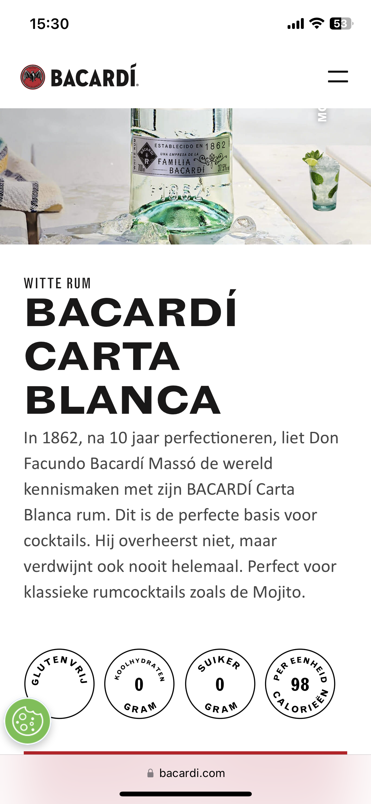
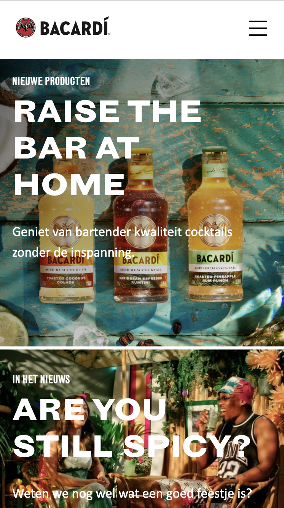
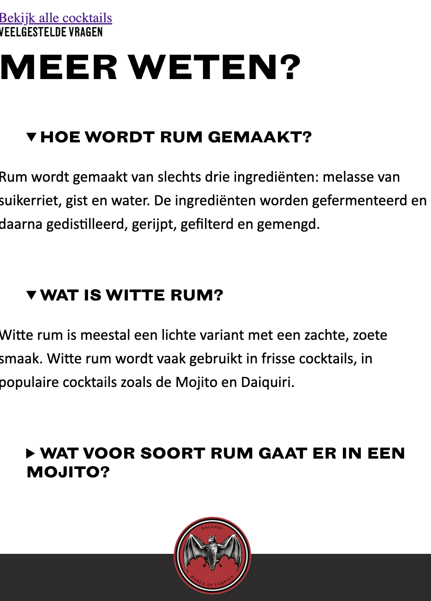

# Procesverslag

Markdown is een simpele manier om HTML te schrijven.  
Markdown cheat cheet: [Hulp bij het schrijven van Markdown](https://github.com/adam-p/markdown-here/wiki/Markdown-Cheatsheet).

Nb. De standaardstructuur en de spartaanse opmaak van de README.md zijn helemaal prima. Het gaat om de inhoud van je procesverslag. Besteedt de tijd voor pracht en praal aan je website.

Nb. Door _open_ toe te voegen aan een _details_ element kun je deze standaard open zetten. Fijn om dat steeds voor de relevante stuk(ken) te doen.

## Jij

  
uitwerken voor kick-off werkgroep

### Auteur:

Vivanne Hoogendam

#### Je startniveau:

blauw

#### Je focus:

Responsive

## Je website

  
uitwerken voor kick-off werkgroep

### Je opdracht:

https://www.bacardi.com/nl/nl/

#### Screenshot(s) van de eerste pagina (small screen):

hier de naam van de pagina  
 

#### Screenshot(s) van de tweede pagina (small screen):

hier de naam van de pagina  
 

## Toegankelijkheidstest 1/2 (week 1)

  
uitwerken na test in 2e werkgroep

### Bevindingen

## Breakdownschets (week 1)

  
uitwerken na afloop 3e werkgroep

### de hele pagina:

### dynamisch deel (bijv menu):

### wellicht nog een dynamisch deel (bijv filter):

  

## Voortgang 1 (week 2)

  
uitwerken voor 1e voortgang

### Stand van zaken

- Ik heb doormiddel van oefeningen in de les mijn eerste section kunnen uitwerken met position relative en absolute. Zie screenshot hierboven.

- Dropdown-menu

### Agenda voor meeting

samen met je groepje opstellen

| student 1      | student 2          | student 3    | student 4        |
| -------------- | ------------------ | ------------ | ---------------- |
| dit bespreken  | en dit             | en ik dit    | en dan ik dat    |
| en dat ook nog | dit als er tijd is | nog een punt | dit wil ik zeker |
| ...            | ...                | ...          | ...              |

### Verslag van meeting

hier na afloop snel de uitkomsten van de meeting vastleggen

- Dropdown menu uitwerking
- A11y Hide content kunnen toepassen voor de h1
- Meta data in de head tag aanpassen
- Border bottom/top gebruiken voor lijntjes onder tekst.

## Voortgang 2 (week 3)

  
uitwerken voor 2e voortgang

### Stand van zaken

--> het uitwerken van een footer ging uiteindelijk veel makkelijker dan gedacht. Ik moet het niet ingewikkelder maken dan het is.

--> Ik ben de hamburger menu aan het uitstellen omdat ik niet weet waar ik moet beginnen.

--> Ik kan ondertussen wel inschatten wanneer ik wel en niet divs mag plaatsen.

--> Ik moet nogsteeds beginnen aan het responsive maken van mijn website

--> Tot nu toe gelukt en klaar: Footer, Nav bar (alleen niet klikbaar), de fonts zijn erin gezet, de eerste sectie is af (na het plaatsen van een gradient.)

wat wil ik graag weten?

-- Kan je makkelijk een gradient overlay boven een image plaatsen?

### Agenda voor meeting

samen met je groepje opstellen

| student 1      | student 2          | student 3    | student 4        |
| -------------- | ------------------ | ------------ | ---------------- |
| dit bespreken  | en dit             | en ik dit    | en dan ik dat    |
| en dat ook nog | dit als er tijd is | nog een punt | dit wil ik zeker |
| ...            | ...                | ...          | ...              |

### Verslag van meeting

hier na afloop snel de uitkomsten van de meeting vastleggen

- punt 1
- punt 2
- nog een punt
- ...

## Toegankelijkheidstest 2/2 (week 4)

  
uitwerken na test in 9e werkgroep

### Bevindingen

Lijst met je bevindingen die in de test naar voren kwamen (geef ook aan wat er verbeterd is):

## Voortgang 3 (week 4)

  
uitwerken voor 3e voortgang

### Stand van zaken

hier dit ging goed & dit was lastig (neem ook screenshots op van delen van je website en code)

### Agenda voor meeting

samen met je groepje opstellen

| student 1      | student 2          | student 3    | student 4        |
| -------------- | ------------------ | ------------ | ---------------- |
| dit bespreken  | en dit             | en ik dit    | en dan ik dat    |
| en dat ook nog | dit als er tijd is | nog een punt | dit wil ik zeker |
| ...            | ...                | ...          | ...              |

### Verslag van meeting

hier na afloop snel de uitkomsten van de meeting vastleggen

- punt 1
- punt 2
- nog een punt
- ...

## Eindgesprek (week 5)

  
uitwerken voor eindgesprek

### Je uitkomst - karakteristiek screenshots:

  

### Dit ging goed/Heb ik geleerd:

Korte omschrijving met plaatjes

  

### Dit was lastig/Is niet gelukt:

Korte omschrijving met plaatjes

  

## Bronnenlijst

  
continu bijhouden terwijl je werkt

Nb. Wees specifiek ('css-tricks' als bron is bijv. niet specifiek genoeg).
Nb. ChatGpT en andere AI horen er ook bij.
Nb. Vermeld de bronnen ook in je code.

1. bron 1
2. bron 2
3. ...

